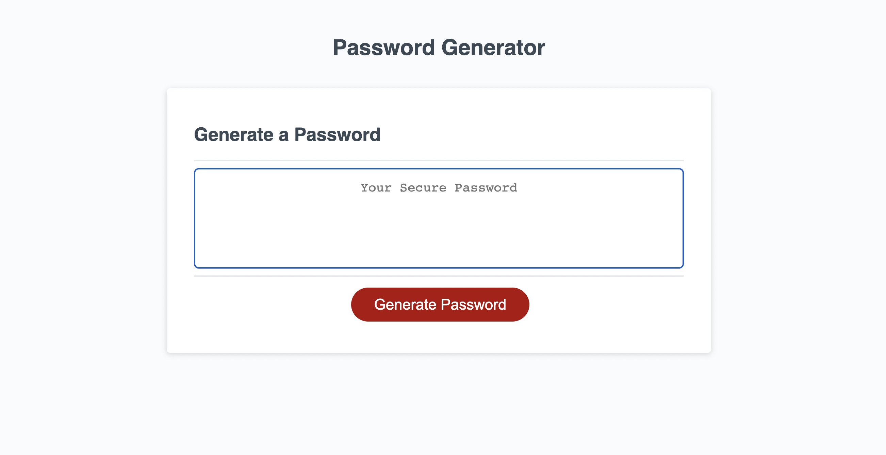

# Password Generator By Benjamin Jacquez
## Description
Basic password generator that generates passwords between 8 and 128 characters with options to include lowercase, uppercase, numeric, and special characters. 

## Deployed Website
[Deployed Version Here](https://ben-jacquez.github.io/password-generator/)

## Table of Contents
- [Description](#description)
- [Deployed-Website](#deployed-website)
- [Technology Used](#technology-used)
- [Usage](#usage)
- [Features](#features)
- [License](#license)

## Technology Used
- Visual Studio Code
- HTML
- CSS
- Javascript

## Usage
Click the generate password button then you will be prompted with 5 options; Character Length (Between 8 - 128), and ok or cancel options for lowercase, uppercase, numeric, and special characters. After all selections are made you can copy your new password from the box in the center.

## Features
There's a Generate password button, When clicked the user is prompted options for 
- Character length 
- Upper, and Lower case letters 
- Numeric values 
- & Special characters

## License
MIT License

Copyright (c) 2022 Benjamin Jacquez

Permission is hereby granted, free of charge, to any person obtaining a copy
of this software and associated documentation files (the "Software"), to deal
in the Software without restriction, including without limitation the rights
to use, copy, modify, merge, publish, distribute, sublicense, and/or sell
copies of the Software, and to permit persons to whom the Software is
furnished to do so, subject to the following conditions:

The above copyright notice and this permission notice shall be included in all
copies or substantial portions of the Software.

THE SOFTWARE IS PROVIDED "AS IS", WITHOUT WARRANTY OF ANY KIND, EXPRESS OR
IMPLIED, INCLUDING BUT NOT LIMITED TO THE WARRANTIES OF MERCHANTABILITY,
FITNESS FOR A PARTICULAR PURPOSE AND NONINFRINGEMENT. IN NO EVENT SHALL THE
AUTHORS OR COPYRIGHT HOLDERS BE LIABLE FOR ANY CLAIM, DAMAGES OR OTHER
LIABILITY, WHETHER IN AN ACTION OF CONTRACT, TORT OR OTHERWISE, ARISING FROM,
OUT OF OR IN CONNECTION WITH THE SOFTWARE OR THE USE OR OTHER DEALINGS IN THE
SOFTWARE.
